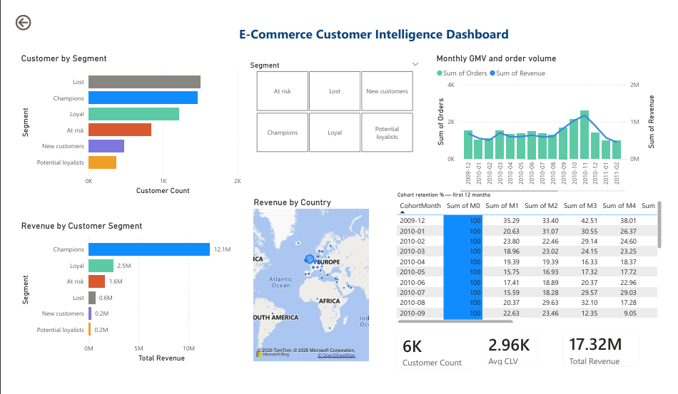

# Ecommerce Customer Analytics & Retention Intelligence Dashboard

## Project Overview

This project analyzes ecommerce customer behavior using:
- RFM Segmentation
- Cohort Retention Analysis
- Customer Lifetime Value (CLV)
- Revenue Trend Analysis

## Tech Stack

- Python
- Pandas
- DuckDB
- SQL
- Power BI
- Jupyter Notebook

## Dashboard Preview

## Key Insights

> RFM segmentation, cohort retention & market basket analysis  
> on 793K transactions · £17.3M revenue · 5,860 customers  
> **Tools:** Python, Pandas, DuckDB, SQL, Power BI · [View →](https://github.com/rudraparmar442/Ecommerce-Customer-Analytics.git)
